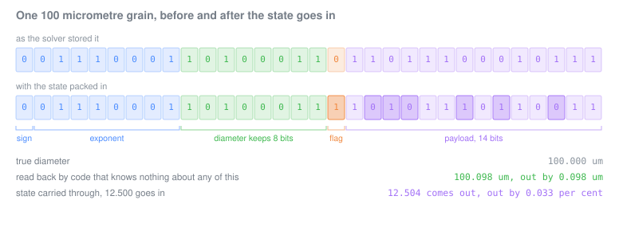
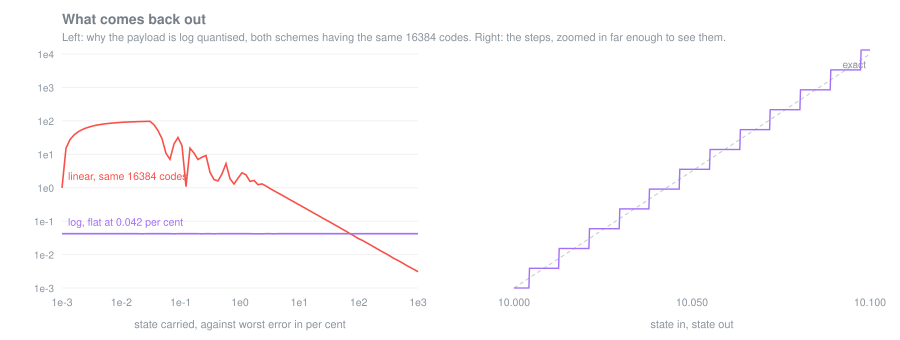
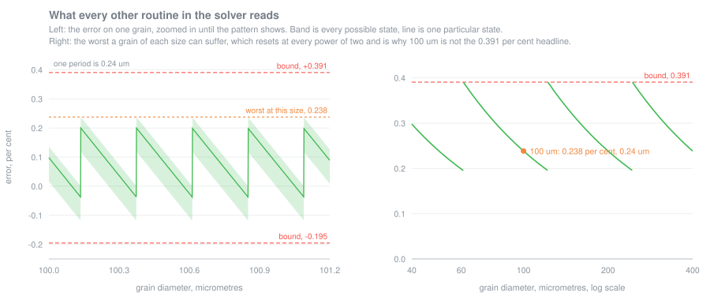
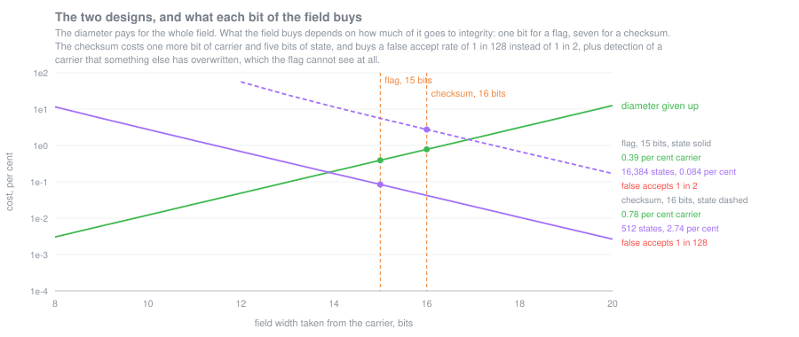

# Carrying per-object state through an API that has no room for it

[](https://github.com/nilot-pal/mantissa-state-channel/actions/workflows/ci.yml)

A Lagrangian particle tracker inside a closed commercial solver. Particles migrate between MPI
ranks as they cross partition boundaries. The solver's user API exposes a fixed set of per-particle
fields and no way to add one, and the source is not available.

The physics needed history: a damage state accumulating over sub-threshold impacts, so a particle
weakened earlier fractures at a lower threshold later. History that does not survive rank migration
is not history.

This is the technique that solved it, reimplemented in C++ with the tests the production version
could never have. The production version is Fortran 90 running inside ANSYS CFX under MPI.

Bit-packing is not new. What this repo is about is what makes it safe to do inside somebody else's
solver: the guards, the fallback, a proven error bound, a measured cost, and a channel that can tell
when the carrier it is reading is not the one it wrote.

---

## The constraint

Everything obvious fails first, and the reasons are the interesting part:

| Approach | Why it does not work here |
|---|---|
| A side table keyed by particle ID | The solver exposes no stable particle identity across ranks. Recovering it after the fact is a separate problem, and a hard one: [cfx-particle-id-recovery](https://github.com/nilot-pal/cfx-particle-id-recovery) |
| An additional solver field | Not available. The API is fixed-width by design |
| A per-rank side file | Does not survive migration, and the I/O cost is prohibitive at millions of parcels |
| Recompute the history from the trajectory | The trajectory is written for post-processing, not readable during the run |

What is left is the set of fields that already migrate with the particle. One of them, the
diameter, is a single-precision float whose low mantissa bits describe a grain to a precision no
measurement of a grain ever had.

The state goes in those bits, and the budget is tight: 23 mantissa bits, of which this takes 15, or
16 in the design that also checks its own work.

## Where this sits in a simulation

A grain strikes a blade. The solver calls the user routine, the routine decides what happens, and
the particle that carries on is described by exactly six return values:

| Returned for the child | What becomes of it |
|---|---|
| Breakup indicator | Read once, to decide whether the parent survived |
| **Diameter** | **Travels onward with the particle** |
| Number rate | A statistical weight, how many real grains this parcel stands for |
| Normal coefficient of restitution | Consumed by the rebound, then gone |
| Parallel coefficient of restitution | Consumed by the rebound, then gone |
| Mode | Read once, which outcome branch was taken |

That is the whole channel between one impact and the next. Four of the six are consumed on the spot.
One is a weight. **One is a continuous physical quantity that is still attached to the particle when
it reaches the next blade, and it is the diameter.**

The physics needs a seventh number: how damaged the grain already is, so that a grain battered
through three stages breaks at a lower threshold than one that just entered. There is no seventh
slot, there is no way to add one, and a grain that migrates to another MPI rank between the two
impacts loses anything held on the side.

So the choice of carrier is not a preference. Of the six, the diameter is the only one still there
when it matters, which is why the state goes into the one field that has room for it and no space
to spare.

## What it does



Real bits, generated by running the library, not drawn by hand. A 100 micrometre grain goes in, a
damage state of 12.5 goes in with it, and what comes back out is a diameter any other routine can
use and a state this one can read.

**Log-quantised payload.** The damage state has multiplicative resolution: the difference between
1% and 2% damage matters, the difference between 80% and 81% does not. A log-quantised payload
spends its bits where the physics can use them.



Given the same 16384 codes, a linear payload would put a hundred per cent error on the bottom two
decades of the range and spend most of its resolution on the top decade, where nothing needs it.
Log spacing holds the error at 0.042 per cent everywhere, which is half a step.

**A flag bit, and then a checksum instead.** Without a flag, an unflagged carrier is
indistinguishable from a flagged carrier whose payload happens to be zero, and the fallback path
becomes unreachable. But a flag only answers half the question, and the design that shipped answers
both. See the two designs, below.

**Refusal, not corruption.** Denormals, zeros, infinities, NaN and negative carriers are returned
untouched. A carrier that cannot safely hold a payload is not forced to.

## The property that makes it usable

**Code that knows nothing about the encoding still reads a usable diameter.**

That is the whole reason this is deployable inside a solver you did not write. Every other routine
in that solver reads the diameter field: drag, the rebound model, the erosion model, the exports.
None of them know the low bits mean anything, and none of them need to.



**This is not free, and the honest version of the argument matters.** Taking 15 of 23 mantissa bits
leaves 8 for the diameter, so the carrier moves by at most **0.39%**, a relative step of 2⁻⁸.

The movement is not a plain truncation. The low bits are masked away and then the flag and the
payload are written back into them, and because the flag is the top bit of the field the packed
value lands in the upper half of the interval. So it is skewed upward: between **0.20% below** and
**0.39% above** the true diameter, not downward as a masking argument alone would suggest. Test 3
asserts both edges and constructs both extremes rather than sampling for them.

The relative bound is largest for a significand of 1 and falls as the significand rises towards 2,
so what it comes to in physical units depends on where the grain sits between two powers of two. For
a **100 micrometre grain the worst case is 0.24 micrometres**, and no grain anywhere in the size
range moves by more than 0.39% of itself.

The case for accepting that is not that the cost is negligible in the abstract, and it is not a
number this repository can settle on your behalf. It is a test with three parts, and the technique
is safe exactly when all three pass:

- the quantisation is finer than the bins the size distribution is specified in;
- it is finer than the shortest length the mesh resolves;
- it is finer than the tolerance of whatever the model was calibrated against, which for a sieved
  fraction is the sieve specification itself.

Those three are properties of the case, not of the code, so run the test against your own before
adopting this.

For the second, here is what it looked like in practice. Every blade surface in a multi-stage
compressor case, an inlet guide vane and three stages of rotor and stator, taking the square root of
the nodal area as the length a facet resolves, over **385,170 nodes across 11 surfaces**:

| | Facet length | Against a 0.24 micrometre quantisation |
|---|---|---|
| Finest facet in the whole machine | 1.09 um | 4.6 times coarser |
| First percentile | 8.4 um | 35 times |
| Fifth percentile | 19.4 um | 81 times |
| Median facet | 165 um | 692 times |

The typical facet is nearly three orders of magnitude larger than the error the channel puts into
the diameter, which is the margin the argument wants. The interesting number is the other one: the
single finest facet anywhere in the machine, one node out of 385,170, still clears it by a factor of
only about five. Comfortable, not enormous. That is the number to watch if the payload were ever
widened, because two more payload bits would spend that margin entirely.

A quantisation you cannot measure is not a quantisation anyone can act on, and one you can measure
is a defect.

Applied to a field the physics actually resolves, the same technique would be a bug. Test 3 asserts
the bound and test 7 asserts the consequence in micrometres, which is the form the argument has to
take when a reviewer asks whether it is safe.

## Tests

Thirteen tests, and they are the artifact. A packing routine is a hundred lines; the tests are the
difference between this and a blog post.

| | |
|---|---|
| Round trip, exhaustive | Every representable payload, across carriers spanning the physical range |
| Flag discrimination | A value with the field clear returns bit-for-bit unchanged and never yields a payload. The converse does not hold, and the test says so |
| Carrier fidelity | The relative error is bounded above and below, across every exponent in the normal range, and both edges are reached |
| Guards, non-finite | Infinities and NaN refused |
| Guards, denormal and zero | Refused. Packing must never produce a value in a class the host solver does not expect |
| Guards, sign | Negative carriers refused |
| **Graceful degradation** | An unaware consumer reads a diameter within tolerance, asserted in micrometres |
| Idempotence | Packing a packed value does not corrupt it; unpacking an unpacked value is a no-op |
| Payload boundaries | Zero, maximum, and above maximum, which clamps rather than wrapping |
| Type-punning safety | Conversion through `memcpy`, no strict-aliasing violation |
| Fuzz | 10 million random carrier and payload pairs, all invariants |
| **The checksum design** | Round trip, tamper detection against single bit disturbances, and the false accept rate, each measured against the flag design side by side |
| Benchmark | **1.0 ns to pack, 1.4 ns to unpack**, against **4.4 ns for one particle position update**. Carrying the state through a tracking loop adds **3.9 ns per particle per step**, about nine tenths of one position update |

The benchmark compares against a deliberately cheap position update: a drag relaxation and a
three-component integration, with no cell search and no interpolation of the carrier phase. Real
Lagrangian tracking costs a good deal more per particle per step than that, so the ratio above is an
upper bound on the relative cost rather than a typical one.

```
cmake -S . -B build && cmake --build build && ctest --test-dir build
```

CI builds this on **gcc, clang and MSVC, each with strict floating point and with fast maths**, six
configurations, and runs the whole suite on all of them. The portability claim is re-proven on every
push rather than asserted once.

The figures above are generated by running the library, so a number in a figure cannot drift away
from the code without the build noticing. The data behind each one is in `docs/data`:

```
cmake --build build --target figures && ./build/Release/figures
node tools/render-figures.js
```

## The two designs

A flag bit answers one question: is there a payload here. It cannot answer the two that matter more.

**Is this a carrier I packed, or one I have never seen?** Half of all diameters have bit 14 set
already, so the flag says yes to both.

**Is this a carrier that something else has written since I packed it?** The flag survives any change
to the bits above it, so the flag says yes to that too, and hands back a payload assembled from
whatever the arithmetic left behind.

The answer is to spend the bit differently. Instead of one bit saying *there is something here*,
spend seven on a checksum over the carrier itself, taken across the exponent and the mantissa bits
that survive encoding:

```cpp
std::uint32_t h = (base_mantissa >> field_bits) ^ biased_exponent;
h ^= h >> 4;
h ^= h >> 2;
return h & checksum_max;
```

On the way back out, the checksum is recomputed from the carrier in hand and compared with the one
stored in it. They agree only if the carrier is the one the payload was written against.

|  | Flag, 15 bits | Checksum, 16 bits |
|---|---|---|
| Diameter given up | 0.39% | 0.78% |
| States carried | 16,384 | 512 |
| State resolution over six decades | 0.084% | 2.74% |
| A carrier never packed reads as packed | **1 in 2** | **1 in 128** |
| A carrier overwritten by something else | **never detected** | **detected** |
| Stripping guarantees a bare carrier | yes | 127 times in 128 |

Measured, not argued: test 13 disturbs a bit above the field on 200,000 packed carriers and the
checksum catches **every one**, where the flag design catches **none**, by construction. It puts two
million never-packed carriers through both and gets 0.0078 against 0.4995.

**And the case for it is not hypothetical.** A grain arriving at its first impact has never been
packed. Its state is drawn fresh at that moment, and there is nothing in the diameter to read. So
in every run, on every grain, the first read is of a carrier that was never written, and the channel
has to be able to say so. With a flag bit, about half of those first impacts report a payload that
does not exist and hand the model a damage state assembled out of the grain's own size. With the
checksum, 127 in 128 are refused and the caller does the right thing, which is to treat the grain as
fresh.

That is the failure the flag design cannot be talked out of. It is not a corner case, it is the
first thing that happens to every particle.



**The checksum design is the one that ran.** The flag design is kept here because it is the simpler
thing to understand first, because it is what the arithmetic looks like without the integrity
machinery on top, and because the pair is the argument: the second design is not a better idea than
the first, it is the first one after the failure modes were understood, paid for at a stated price.

The price is not small. One more bit of carrier is cheap; **five bits of state is not**, and 512
states is a real constraint. It is affordable only when the state resolution needed is coarser than
the scatter in the quantity being carried, which is a question about the model and not about the
channel. Where the state needs finer resolution than that, the flag design with its 16,384 states is
the right one, and the initialisation discipline has to be enforced by other means.

Both are in `state_channel.hpp`: the flag design at namespace scope, the checksum design in
`namespace guarded`.

**The encoding is not private to the code that writes it.** A run writes packed diameters into an
export and a post-processor decodes them afterwards, in a different language, written at a different
time. If the two ever disagree about one bit, every state read back is wrong and nothing announces
it. So test 13 pins the layout with known-answer vectors generated by a separate implementation:
carrier bits in, packed bits out, checked exactly. A refactor that changes the wire format has to
fail that test to get through.

## When this works, and when it does not

Everything above says what the technique costs. This says where it is valid, which is the question
to answer before putting it in a solver rather than in a repository.

**Grain size does not matter, and that is worth saying plainly.** The cost is relative, so a 1 mm
grain loses 3.9 micrometres and a 1 micrometre grain loses 0.0039 micrometres, and both lose 0.39
per cent. There is no size range where the technique degrades, and against a size distribution
binned logarithmically that is the behaviour you want. The only variation is the factor of two from
where a grain falls between two powers of two, which the figure above shows.

**The field width is the one real design choice, and the section above is what it costs.**

**What will break it, in the order it is likely to bite:**

1. **Anything else that writes the diameter.** The carrier must be written only by the encoder. In
   the production version every child diameter goes through the encode function and nothing else
   touches the field, so the invariant holds by construction. Put this in a solver where a second
   model writes that field, an evaporation or mass transfer model, or another user routine that
   scales it, and the payload becomes whatever the arithmetic left behind.
   **With the flag design that is not a fallback, it is a wrong state that looks like a valid one,
   and the flag cannot see it.** With the checksum design it is caught and the caller falls back,
   which is the whole reason the checksum exists. Either way, check who writes the field before
   anything else: detection is a safety net, not a licence.
2. **Arithmetic, as opposed to storage.** Copying, buffering and sending the value across a rank
   boundary are all exact and the tests cover it. A single multiply by 1.0 is not: the low bits are
   gone. The field survives being moved, never being computed with.
3. **Saturation is silent.** A state above the top of the range clamps rather than wrapping, which
   is the safe choice, but a range set too low means every particle saturates and history stops
   accumulating while the run still looks healthy. Choose the range with headroom, and check the
   fraction of particles sitting at the top code before believing a result.
4. **A carrier that is not a diameter.** The whole argument rests on the low bits being below the
   resolution of everything downstream. Applied to a field the physics resolves, a velocity
   component or a temperature, the same code is a bug with a proof attached.
5. **One architecture.** Built and tested on gcc 13, clang 18 and MSVC, but only on x86-64. The
   layout asserts IEEE-754 binary32 at compile time; a big-endian target has not been tried.

**What does not break it**, because the tests say so rather than because it seems unlikely:
inadmissible carriers of every class, ten thousand repeated updates on one particle without drift,
payloads above the maximum, and ten million random carrier and payload pairs.

## What to distrust

- **This is a reimplementation, not the production code.** The version that ran in anger is Fortran
  90 inside a commercial solver, is sponsor work, and is not public. The technique here is the
  same; the code is not.
- **The technique is old.** Packing state into unused bits predates all of us. Nothing here is
  claimed as novel except the specific application: per-object state surviving MPI migration
  through a fixed-width Lagrangian API, with a fallback that keeps the host solver correct.
- **It is not free.** You give up precision on the carrier, permanently and silently, and here
  that is 15 of 23 mantissa bits. It is acceptable only because the bound is provable and lands
  below the resolution of everything downstream. Applied to a field the physics resolves, it is a
  bug.
- **Single precision, IEEE-754 binary32.** That is the constraint the production version ran under,
  and it is what makes the bit budget interesting. On binary64 there are 52 mantissa bits and the
  same payload costs nothing worth discussing, so the double-precision case is the easy one.
- **The payload width is a compile-time constant** and the error bound is derived from it. Change
  the width and the bound changes; the tests assert the relationship rather than a magic number.
- **The flag says "initialised", not "packed by me".** It is one bit in a field this code does not
  own, so an ordinary diameter that was never packed, whose bit 14 happens to be set, reads as
  flagged and yields whatever its low bits contain. About half of arbitrary carriers do, and test 2
  asserts that rate rather than leaving it to be discovered. The checksum design cuts this to one in
  128 but does not remove it, and nothing can: a check that lives inside the carrier can always be
  matched by accident. Both designs still assume the host initialises every particle through the
  channel exactly once at injection. The fallback covers carriers that were inadmissible at that
  moment, not carriers nobody ever touched.
- **It costs the inner loop its vectorisation, and that is the larger half of the cost.** The
  branch and the integer work stop the compiler vectorising a loop it would otherwise vectorise.
  Measured here: the channel's own work is 3.9 ns per particle per step, and the vectorisation
  forgone is a further 3.5 ns. The comparison in the table is against a scalar baseline for that
  reason. It costs nothing in a loop that was never going to vectorise, which is what a real
  tracking loop with a cell search in it looks like, but that is an argument to check on your own
  solver rather than to take on trust.
- **Three compilers, each of which found something different.** gcc 13, clang 18 and MSVC, strict
  and fast maths, six configurations in CI. The first run failed four of the six: clang rejects a
  loop pragma the other two accept, gcc's fast maths is aggressive enough to break assumptions
  MSVC's leaves alone, and clang's optimiser disproved a performance ordering the benchmark had been
  asserting. One compiler would have found none of them, which is why the claim is worth making
  this way rather than by saying the code looks portable.
- **Fast maths does not break the guards, but it does delete the tests that describe them.** The
  default build is strict. The suite also runs under `-ffast-math` and `/fp:fast`, in CI, on every
  compiler.

  The guards survive, because they classify the integer bits from `memcpy` and never look at the
  float, so there is nothing for the optimiser to reason about. What does not survive is any
  assertion written *about* those values as floats. Under fast maths the compiler is told NaN,
  infinity and signed zero do not occur, and it acts on it: `std::isnan` folds to false, a NaN
  compares equal to itself, and a `-0.0f` sitting in a `const float` array can be stored as `+0.0f`.
  Clang says so out loud, with `-Wnan-infinity-disabled`.

  So those assertions are compiled out under that flag and the ones about the library are not. That
  split is the argument for writing the guards this way rather than as `d > 0.0` and `std::isnan(d)`:
  **the same flag that deletes those assertions would have deleted the guards**, and nothing would
  have said so. Set somewhere else in a build you do not control, that is a silent failure.

## Why it was worth doing

Sub-threshold impacts do not break a particle, but they weaken it. Without history every impact is
evaluated against a fresh particle, so a grain that has been battered through three compressor
stages fractures at the same threshold as one that just entered. That is not a small correction: in
a machine where the impact population is grazing-dominated, almost every impact is sub-threshold,
and a model without history is a model in which almost nothing accumulates.

The state channel is what makes history-dependent weakening possible at all inside a solver that
was not built for it.
